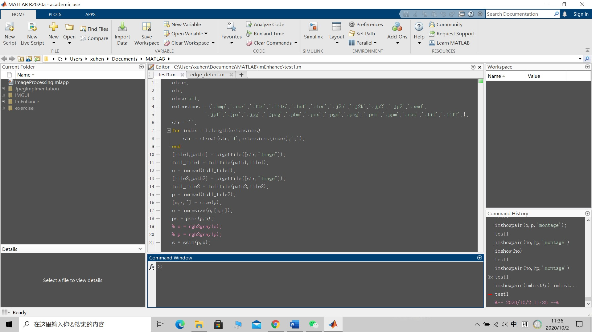

# ImagePlayer
This is my graduation project.
This project involves the development of a MATLAB image processing application. The application will allow users to upload and process images through functions including: compression, equalisation, adding noise, denoising, mosaic and edge detecting. After these operations are performed the application allows the user to compare the pre- and post-processed images, and download the processed image. 
How to use: download the ImagePlaer.mlapp file, it requires the latest version of MATLAB which has an app designer component. Move the file into the MATLAB and double click to open it, the code will be in the code view of the app designer interface. As shown below:

